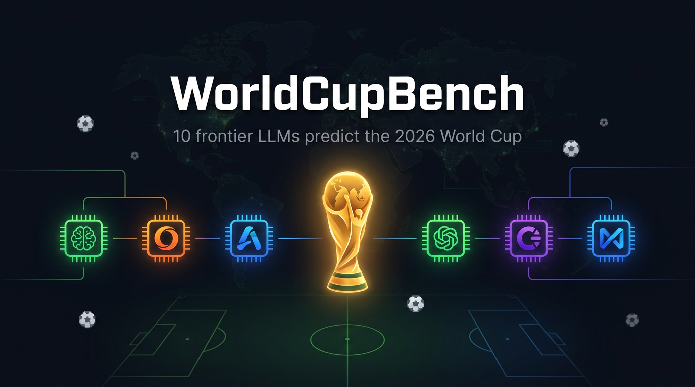

<p align="center">
  
</p>

<h1 align="center">WorldCupBench ⚽🤖</h1>

<p align="center">
  <strong>The World Cup is the ultimate LLM benchmark.</strong><br>
  11 frontier AI models predicted every match of the 2026 FIFA World Cup — frozen pre-tournament, scored live, bet against Polymarket.
</p>

<p align="center">
  <a href="LICENSE"></a>
  
  
  
</p>

<p align="center">
  Based on <a href="https://github.com/mverab/WorldCupBench">WorldCupBench by @mverab</a> — extended with live Polymarket odds, council aggregation, and Kelly betting engine.
</p>

---

## What's New in This Fork

| Feature | Original | This repo |
|---------|----------|-----------|
| Predictions from SOTA LLMs | ✅ | ✅ |
| Leaderboard (Brier + accuracy) | ✅ | ✅ |
| **Live Polymarket odds auto-fetch** | ❌ | ✅ `src/fetch_odds.py` |
| **Council — weighted LLM ensemble** | ❌ | ✅ `src/council.py` |
| **Kelly Criterion bet engine** | ❌ | ✅ `src/betting.py` |
| **Inverse-Brier model weighting** | ❌ | ✅ |

---

## How It Works

```
Same prompt ──► 11 SOTA LLMs (via OpenRouter)
                       │
                       ▼
              Structured JSON predictions
              (72 matches, 1X2 probs, scores)
                       │
            ┌──────────┴──────────┐
            │                     │
     Frozen & scored live    Council aggregator
     (Brier + outcome +      (inverse-Brier weights)
      exact score)                │
                                  ▼
                         Polymarket live odds
                                  │
                                  ▼
                         Kelly Criterion sizing
                         (edge detection + stake)
```

1. **Same prompt** → 11 SOTA LLMs via OpenRouter.
2. **Structured JSON** → every match, every round, every score, with 1X2 probabilities.
3. **Frozen before kickoff** → committed before the opening match. No post-hoc edits. Credibility is everything.
4. **Scored live** → Brier score, outcome accuracy, and exact-score points updated as real results come in.
5. **Polymarket odds** → automatically fetched from the Gamma API for all 72 group-stage matches.
6. **Council + Kelly** → models are weighted by performance; the ensemble identifies value bets and computes Kelly stake sizes.

---

## Live Leaderboard

<!-- LEADERBOARD:START -->

_No scored matches yet. Leaderboard updates automatically as real results come in._

<!-- LEADERBOARD:END -->

---

## Quick Start

```bash
# Clone and setup
git clone <your-repo-url>
cd WorldCupBench
python -m venv venv && source venv/bin/activate   # Windows: venv\Scripts\activate
pip install -r requirements.txt

# Configure API key
cp .env.example .env
# Edit .env and add your OPENROUTER_API_KEY

# Run predictions for all models
python src/run_predictions.py

# Run specific models only
python src/run_predictions.py --models GPT-5.5 Grok-4.3

# Validate setup without calling APIs
python src/run_predictions.py --dry-run

# Fetch live Polymarket odds
python src/fetch_odds.py
# or to a custom path:
python src/fetch_odds.py --output data/odds/odds.json

# Generate / update leaderboard in README
python src/generate_leaderboard.py --inject-readme
```

---

## Models (SOTA, June 2026)

| Model | Provider | OpenRouter ID |
|-------|----------|---------------|
| GPT-5.5 | OpenAI | `openai/gpt-5.5` |
| Claude Fable 5 | Anthropic | `anthropic/claude-fable-5` |
| Gemini 3.5 Flash | Google | `google/gemini-3.5-flash` |
| Grok 4.3 | xAI | `x-ai/grok-4.3` |
| DeepSeek V4-Pro | DeepSeek | `deepseek/deepseek-v4-pro` |
| Qwen 3.7 Max | Alibaba | `qwen/qwen-3.7-max` |
| Kimi K2.6 | Moonshot AI | `moonshotai/kimi-k2.6` |
| GLM-5.1 | Zhipu AI | `z-ai/glm-5.1` |
| MiniMax M3 | MiniMax | `minimax/minimax-m3` |
| MiMo V2.5-Pro | Xiaomi | `xiaomi/mimo-v2.5-pro` |
| Nex-N2-Pro | Nex AGI | `nex-agi/nex-n2-pro:free` |

All models receive the **exact same prompt** and must return structured JSON covering all 104 matches. See [`prompts/prediction_prompt.txt`](prompts/prediction_prompt.txt).

---

## Polymarket Odds Integration

`src/fetch_odds.py` pulls live 3-outcome (home / draw / away) prices for all 72 group-stage matches directly from the [Polymarket Gamma API](https://gamma-api.polymarket.com) (series `soccer-fifwc`, event IDs 351715–351786).

```bash
python src/fetch_odds.py             # writes to data/odds/odds.json
python src/fetch_odds.py --dry-run   # print first 5 matches, no disk write
```

Each match entry in `data/odds/odds.json`:

```json
{
  "match_id": "25",
  "home_team": "GER",
  "away_team": "CUW",
  "date": "2026-06-14",
  "source": "polymarket",
  "prices": { "home": 94.45, "draw": 3.9, "away": 2.05 },
  "odds":   { "home": 1.06,  "draw": 25.64, "away": 48.78 }
}
```

- **prices** — raw Polymarket implied probability × 100 (sums to ~100%)
- **odds** — decimal bookmaker odds (`1 / price`)
- Already-resolved matches are automatically skipped.

---

## Council: Weighted LLM Ensemble

`src/council.py` aggregates all 11 models into a single **council probability** per match, weighted by each model's inverse Brier score (better-calibrated models carry more weight).

```
council_prob = Σ (w_i × prob_i)    where  w_i ∝ 1 / (brier_i + ε)
```

Output per match:

| Field | Description |
|-------|-------------|
| `council_probs` | Weighted aggregate 1X2 probabilities |
| `recommended_outcome` | `argmax(council_probs)` |
| `confidence` | Probability of the recommended outcome |
| `agreement_rate` | Fraction of models that agree with the recommendation |
| `predicted_score` | Weighted average of model score predictions |

---

## Kelly Criterion Betting Engine

`src/betting.py` compares council probabilities against Polymarket odds and identifies value bets:

```
edge    = (council_prob × odd) − 1
kelly_f = edge / (odd − 1)
stake   = min(bankroll × kelly_f / 4,  bankroll × 5%)
```

A bet is only recommended when:
- `edge > 5%`
- `agreement_rate ≥ 55%`
- `confidence ≥ 45%`
- Fractional Kelly (÷4) with 5% bankroll hard cap for risk management.

---

## Scoring Methodology

Three independent metrics are computed per match:

| Metric | Direction | Source field |
|--------|-----------|--------------|
| **Brier score** | ↓ lower is better | `probs.{home,draw,away}` |
| **Outcome accuracy** | ↑ higher is better | `argmax(probs)` |
| **Exact-score points** | ↑ higher is better | `predicted_result` + `predicted_score` |

> **Important:** The leaderboard ranking is driven by Brier score and outcome accuracy — both computed strictly from the 1X2 probability vector. `predicted_result` and `predicted_score` feed only the exact-score metric.
>
> In tight matches a model can rationally assign the highest probability to one outcome while picking a different single result. This is a valid probabilistic decision, not a data error. All 792 frozen predictions (11 models × 72 group matches) were audited: **0 inconsistencies**.

### Freeze Provenance (`freeze-v3`)

All predictions carry a tamper-evident audit trail:

- `source_schema: "freeze-v3"` — schema version used at generation time
- `model_id` — exact checkpoint queried (e.g. `anthropic/claude-5-fable-20260609`)
- `generated_at` — UTC timestamp
- `orientation_flipped` — `true` when home/away were stored in reverse; all fields (`probs`, `predicted_result`, `predicted_score`) are normalized to the official fixture orientation

---

## Project Structure

```
.
├── README.md
├── FREEZE.md                           # Audit log: commit hash, timestamps, checksums
├── LICENSE
├── .env.example
├── requirements.txt
├── schema/
│   └── predictions_schema.json         # JSON Schema draft-07
├── prompts/
│   └── prediction_prompt.txt           # Identical prompt sent to every model
├── src/
│   ├── run_predictions.py              # Entry point — collect predictions
│   ├── models_config.py                # Model registry (name, model_id, provider)
│   ├── utils.py                        # Parsing, validation, I/O helpers
│   ├── generate_leaderboard.py         # Build & inject leaderboard into README
│   ├── fetch_odds.py                   # ★ Polymarket live odds scraper
│   ├── council.py                      # ★ Weighted LLM ensemble aggregator
│   └── betting.py                      # ★ Kelly Criterion bet-sizing engine
├── predictions/
│   └── pre-tournament/                 # Frozen model prediction JSONs
├── data/
│   ├── tournament.json                 # Official FIFA fixture
│   ├── results/                        # Real match results (live)
│   ├── leaderboard.json                # Computed scores
│   └── odds/
│       └── odds.json                   # ★ Polymarket odds (auto-updated)
└── assets/
    ├── banner.png
    └── social-preview.png
```

> ★ = added in this fork

---

## Add a Model

1. Add an entry to `src/models_config.py`:
   ```python
   {
       "name": "Your-Model-Name",
       "model_id": "provider/model-name",   # OpenRouter ID
       "provider": "Your Lab",
   }
   ```
2. Run `python src/run_predictions.py --models Your-Model-Name`
3. Submit a PR with the generated JSON under `predictions/pre-tournament/`

Verify OpenRouter model IDs at [openrouter.ai/models](https://openrouter.ai/models) before adding.

---

## Credits

This project is a fork of and tribute to **[WorldCupBench](https://github.com/mverab/WorldCupBench)** by [@mverab](https://github.com/mverab) — the original benchmark concept, prompt design, schema, and scoring system. This repository extends the original with live Polymarket integration, council aggregation, and the Kelly betting engine.

---

## License

MIT — see [LICENSE](LICENSE).

> Tournament data sourced from official FIFA sources. This project is for educational and research purposes only.

---

<p align="center">
  <sub>⚽ Built on <a href="https://github.com/mverab/WorldCupBench">WorldCupBench</a> by @mverab — extended with Polymarket, Council & Kelly.</sub>
</p>
